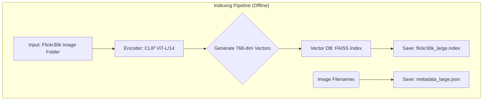
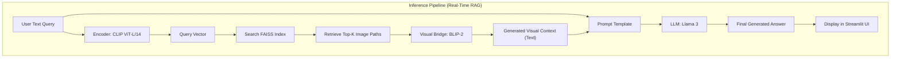
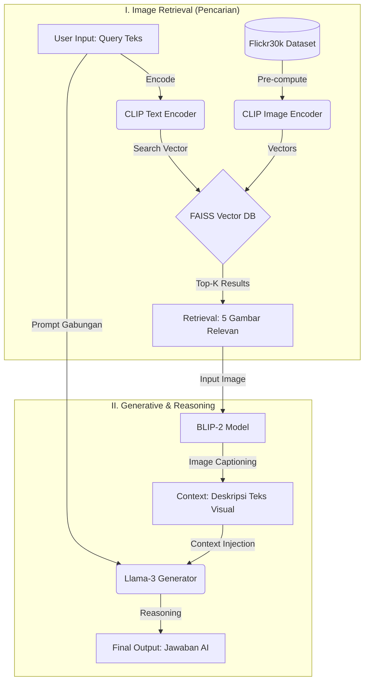

<div align="center">

# A RAG-Based Approach to Image Retrieval and Context-Aware Generation

**Final Project: Advanced Computer Vision (2025)**


A professional, PhD-level implementation of a multimodal Retrieval-Augmented Generation (RAG) pipeline, designed to "see" and "reason" by grounding Large Language Models in visual data.

</div>

## 👥 Project Team

<div align="center">
<table>
<tr>
<td align="center" width="25%">


<strong>Bayu Ardiyansyah</strong>

<em>Data Preprocessing & FAISS Management</em>
</td>
<td align="center" width="25%">


<strong>Bayu Ardiyansyah</strong>

<em>Embedding & Retrieval Metrics (Recall@K)</em>
</td>
<td align="center" width="25%">


<strong>Bayu Ardiyansyah</strong>

<em>BLIP-2/Llama 3 Integration & Prompt Engineering</em>
</td>
<td align="center" width="25%">


<strong>Bayu Ardiyansyah</strong>

<em>Streamlit UI & Full Pipeline Integration</em>
</td>
</tr>
</table>
</div>

## 🏛️ System Architecture & Data Workflow

The system operates in two distinct phases: 1. One-Time Indexing (offline) and 2. Real-Time Inference (online).

### 1. Indexing Pipeline (Offline)

This process is run once to build the vector database. All images from the Flickr30k dataset are converted into high-dimensional vectors using the CLIP encoder and stored in a FAISS index for rapid lookup.



### 2. Inference Pipeline (Real-Time RAG)

This is the live workflow executed when a user submits a query. The system retrieves relevant images, translates them into text context, and generates a final answer.



### 3. RAG Methodology 

This system uses a Retrieve-Then-Generate architecture with a multimodal approach (text & images). The workflow is divided into two main phases: Image Retrieval & Generative Component



## ⚙️ Technology Stack & Parameters

This project uses a specific set of SOTA (State-of-the-Art) models and libraries. The parameters below detail the choices made for each component of the pipeline as per the final project requirements.

| Component     | Technology Chosen                  | Alternative(s) Considered     | Status |
|---------------|------------------------------------|-------------------------------|--------|
| Dataset       | Flickr30k (captions.txt)           | COCO, Fashion-MNIST           | [√]    |
| Embedding     | openai/clip-vit-large-patch14      | clip-vit-base-patch32, ResNet50 | [√]  |
| Vector DB     | FAISS (IndexFlatIP)                | Milvus, ChromaDB              | [√]    |
| Visual Bridge | Salesforce/blip2-opt-2.7b          | blip-image-captioning-large   | [√]    |
| Reasoning LLM | Llama 3 (via Ollama)               | GPT-4, Flan-T5                | [√]    |
| Web UI        | Streamlit                          | Gradio, Hugging Face Spaces   | [√]    |

## 🚀 How to Run

This project has a two-step execution flow: first, you must build the database index, then you can run the interactive application.

### System Requirements

- Python 3.10+
- PyTorch 2.0+
- NVIDIA GPU with CUDA 11.8+ (for GPU-accelerated inference)
- Ollama installed and running locally.

### Step 1: Run the Indexing Notebook

This step populates the FAISS vector database. You only need to do this once.

1. Open the Jupyter Notebook (e.g., `FinalProject_Multimodal_RAG.ipynb`).
2. Ensure all paths in the Config cells are correct for your system. (e.g., `IMAGES_DIR = "../Dataset/Images"`)
3. Execute all cells from top to bottom.

This will create two files in your root directory:

- `flickr30k_large.index` (The FAISS database)
- `metadata_large.json` (The mapping of index IDs to filenames)

### Step 2: Launch the Streamlit Web UI

This step runs the interactive demo application.

1. Ensure Ollama is running:
   ```
   ollama serve
   ```
   (Leave this terminal running in the background)

2. Open a new terminal and navigate to the User Interface directory:
   ```
   cd User_Interface
   ```

3. Run the Streamlit app:
   ```
   streamlit run app.py
   ```

4. Open the provided `http://localhost:8501` link in your web browser.

## 📂 Project Structure

```
.
├── Dataset/
│   ├── Images/
│   │   ├── 1000092795.jpg
│   │   └── ... (all other .jpg files)
│   └── captions.txt
├── User_Interface/
│   └── app.py
├── FinalProject_Multimodal_RAG.ipynb   <-- (Run this first)
├── flickr30k_large.index               <-- (Generated by Notebook)
├── metadata_large.json                 <-- (Generated by Notebook)
├── README.md
├── requirements.txt
└── structure.txt
```

## 📜 License & Use

This project is licensed under the MIT License. It can be freely used for academic, research, and commercial purposes with proper attribution.

## 🤝 Contribution & Feedback

This repository is an academic submission for the Advanced Computer Vision course. For suggestions, critiques, or future collaboration, please contact the project team.

<sub>Disclaimer: This system is built for academic and research purposes. All visual data is sourced from the public Flickr30k dataset. Generated responses are for illustrative purposes and are not guaranteed for real-world application accuracy.</sub>